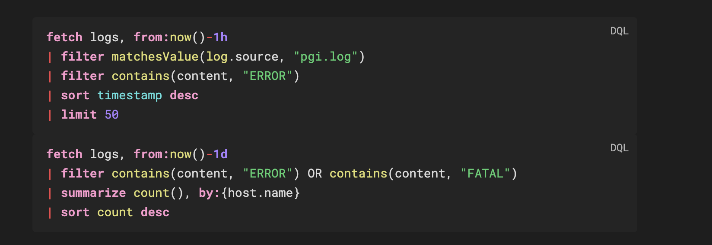

# DQL Syntax

**Obsidian plugin — syntax highlighting for Dynatrace Query Language (DQL)**

Engineers and SREs who document their Dynatrace workflows in Obsidian can get proper syntax highlighting for embedded DQL queries.



---

## Usage

````markdown
```dql
fetch logs, from:now()-1h
| filter matchesValue(log.source, "pgi.log")
| summarize count(), by:{status, host.name}
| sort count desc
| limit 100
```
````

Works in **reading mode** with full token highlighting and a copy button.

---

## Install

### Manual

1. Download `main.js`, `manifest.json`, `styles.css` from the [latest release](https://github.com/AndrewUsher/obsidian-dynatrace-dql/releases/latest)
2. Create `.obsidian/plugins/dql-syntax/` in your vault
3. Copy the three files there
4. Enable in **Settings → Community Plugins**

---

## What gets highlighted

| Token             | Example                                                             |
| ----------------- | ------------------------------------------------------------------- |
| Commands          | `fetch`, `filter`, `summarize`, `sort`, `fields`, `parse`           |
| Functions         | `count`, `sum`, `filter`, `endsWith`, `matchesValue`, `if`          |
| Data types        | `string`, `long`, `double`, `boolean`, `timestamp`, `duration`      |
| Keywords          | `and`, `or`, `not`, `in`, `as`, `by`, `from`, `on`, `true`, `false` |
| Named params      | `from:`, `to:`, `by:`, `on:`                                        |
| Operators         | `\|` `==` `!=` `<=` `>=` `+` `-` `*` `/` `@` `~`                    |
| Strings           | `"double"` `'single'` `` `backtick-quoted` ``                       |
| Duration literals | `1h`, `30m`, `10s`, `7d`, `1w`, `100ms`                             |
| Numbers           | `42`, `3.14`                                                        |
| Comments          | `//` and `/* */`                                                    |

---

## Query Templates

Ready-to-use DQL queries in [`templates/`](./templates):

| File                                                                   | Content                                              |
| ---------------------------------------------------------------------- | ---------------------------------------------------- |
| [`logs-hunting.dql`](./templates/logs-hunting.dql)                     | Log analysis, error tracking, performance breakdowns |
| [`bizevents-analysis.dql`](./templates/bizevents-analysis.dql)         | Business event aggregation and filtering             |
| [`infrastructure-metrics.dql`](./templates/infrastructure-metrics.dql) | Host metrics, timeseries, and Smartscape traversal   |

---

## Build

```bash
npm install
npm run build   # production → generates main.js
npm run dev     # watch mode for development
```

---

## References

- [DQL Language Reference](https://docs.dynatrace.com/docs/platform/grail/dynatrace-query-language/dql-reference)
- [DQL Commands](https://docs.dynatrace.com/docs/platform/grail/dynatrace-query-language/commands)
- [DQL Functions](https://docs.dynatrace.com/docs/platform/grail/dynatrace-query-language/functions)
- [DQL Operators](https://docs.dynatrace.com/docs/platform/grail/dynatrace-query-language/operators)

---

## License

MIT

## Credits

- Inspired by and forked from https://community.obsidian.md/plugins/talon-cql
